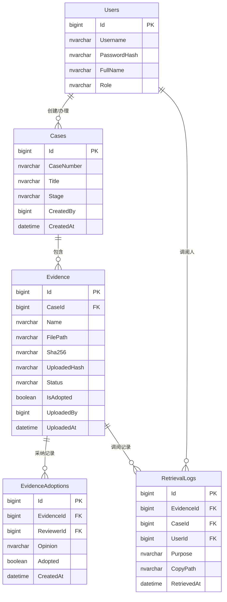

## 1. 架构设计

```mermaid
flowchart LR
    subgraph 前端
        "Vue3+Pinia+AntDesignVue 案卷工作台"
    end
    subgraph 后端["ASP.NET Core 8 Web API"]
        "Controllers" --> "Services" --> "Repositories"
    end
    subgraph 数据与存储
        "SQL Server 元数据/权限/日志" 
        "本地对象目录(证据文件)"
    end
    "Vue3+Pinia+AntDesignVue 案卷工作台" -- "HTTP/JSON" --> "Controllers"
    "Repositories" --> "SQL Server 元数据/权限/日志"
    "Services" --> "本地对象目录(证据文件)"
```

## 2. 技术说明

- 前端：Vue 3 + Pinia + Ant Design Vue + Vite + TypeScript + Vue Router
- 初始化工具：Vite（手动初始化 Vue-TS 工程，按用户技术栈接入 Ant Design Vue 与 Pinia）
- 后端：ASP.NET Core 8 Web API（C#，分层 Controllers / Services / Repositories / Models / Data）
- 数据库：SQL Server（元数据、权限、调阅日志）
- 证据存储：本地对象目录，写入时计算并记录 SHA-256
- 认证：JWT Bearer Token，基于角色的访问控制（办案人员/检察官/书记员/管理员）

## 3. 路由定义

| 路由 | 用途 |
|-------|------|
| /login | 登录页 |
| / | 案卷工作台首页（案件列表） |
| /cases/:id | 案件详情（证据清单、链路时间线） |
| /evidence/upload | 证据上传页 |
| /evidence/:id/review | 证据审查页（检察官） |
| /retrieval | 调阅管理页（书记员） |
| /logs | 调阅日志页 |
| /admin | 系统管理页 |

## 4. API 定义

| 方法 | 路由 | 说明 | 角色 |
|------|------|------|------|
| POST | /api/auth/login | 登录获取 Token | 全部 |
| GET | /api/cases | 案件列表 | 全部 |
| POST | /api/cases | 新建案件 | 办案人员/管理员 |
| GET | /api/cases/{id} | 案件详情 | 全部 |
| GET | /api/evidence?caseId= | 证据列表 | 全部 |
| POST | /api/evidence/upload | 上传证据(含哈希校验) | 办案人员 |
| GET | /api/evidence/{id} | 证据详情 | 全部 |
| POST | /api/evidence/{id}/adopt | 标记采纳意见 | 检察官 |
| POST | /api/retrieval | 调阅登记(用途) | 书记员 |
| GET | /api/retrieval/{id}/download | 下载展示副本 | 书记员 |
| GET | /api/logs | 调阅日志查询 | 检察官/管理员 |
| GET | /api/admin/users | 用户列表 | 管理员 |
| POST | /api/admin/users | 新建用户 | 管理员 |

## 5. 服务器架构图

```mermaid
flowchart TD
    "EvidenceController" --> "EvidenceService"
    "EvidenceService" --> "EvidenceRepository"
    "EvidenceService" --> "FileStorageService(本地对象目录+SHA256)"
    "EvidenceService" --> "HashService(SHA256校验)"
    "EvidenceRepository" --> "AppDbContext"
    "AppDbContext" --> "SQL Server"
    "RetrievalController" --> "RetrievalService"
    "RetrievalService" --> "RetrievalRepository"
    "RetrievalService" --> "AuditLogService"
    "RetrievalRepository" --> "AppDbContext"
```

## 6. 数据模型

### 6.1 数据模型定义



### 6.2 数据定义语言（DDL）

```sql
CREATE TABLE Users (
    Id BIGINT IDENTITY(1,1) PRIMARY KEY,
    Username NVARCHAR(64) NOT NULL UNIQUE,
    PasswordHash NVARCHAR(256) NOT NULL,
    FullName NVARCHAR(64) NOT NULL,
    Role NVARCHAR(32) NOT NULL,
    CreatedAt DATETIME2 NOT NULL DEFAULT SYSUTCDATETIME()
);

CREATE TABLE Cases (
    Id BIGINT IDENTITY(1,1) PRIMARY KEY,
    CaseNumber NVARCHAR(64) NOT NULL UNIQUE,
    Title NVARCHAR(128) NOT NULL,
    Stage NVARCHAR(32) NOT NULL DEFAULT 'Police',
    CreatedBy BIGINT NOT NULL REFERENCES Users(Id),
    CreatedAt DATETIME2 NOT NULL DEFAULT SYSUTCDATETIME()
);

CREATE TABLE Evidence (
    Id BIGINT IDENTITY(1,1) PRIMARY KEY,
    CaseId BIGINT NOT NULL REFERENCES Cases(Id),
    Name NVARCHAR(256) NOT NULL,
    FilePath NVARCHAR(512) NOT NULL,
    Sha256 NVARCHAR(64) NOT NULL,
    UploadedHash NVARCHAR(64) NOT NULL,
    Status NVARCHAR(32) NOT NULL DEFAULT 'Pending',
    IsAdopted BIT NOT NULL DEFAULT 0,
    UploadedBy BIGINT NOT NULL REFERENCES Users(Id),
    UploadedAt DATETIME2 NOT NULL DEFAULT SYSUTCDATETIME()
);

CREATE TABLE EvidenceAdoptions (
    Id BIGINT IDENTITY(1,1) PRIMARY KEY,
    EvidenceId BIGINT NOT NULL REFERENCES Evidence(Id),
    ReviewerId BIGINT NOT NULL REFERENCES Users(Id),
    Opinion NVARCHAR(512) NOT NULL,
    Adopted BIT NOT NULL,
    CreatedAt DATETIME2 NOT NULL DEFAULT SYSUTCDATETIME()
);

CREATE TABLE RetrievalLogs (
    Id BIGINT IDENTITY(1,1) PRIMARY KEY,
    EvidenceId BIGINT NOT NULL REFERENCES Evidence(Id),
    CaseId BIGINT NOT NULL REFERENCES Cases(Id),
    UserId BIGINT NOT NULL REFERENCES Users(Id),
    Purpose NVARCHAR(256) NOT NULL,
    CopyPath NVARCHAR(512) NOT NULL,
    RetrievedAt DATETIME2 NOT NULL DEFAULT SYSUTCDATETIME()
);

CREATE INDEX IX_Evidence_CaseId ON Evidence(CaseId);
CREATE INDEX IX_Adoptions_EvidenceId ON EvidenceAdoptions(EvidenceId);
CREATE INDEX IX_RetrievalLogs_CaseId ON RetrievalLogs(CaseId);
CREATE INDEX IX_RetrievalLogs_UserId ON RetrievalLogs(UserId);

INSERT INTO Users (Username, PasswordHash, FullName, Role)
VALUES ('admin', 'AQAAAAIAAYagAAAAE-placeholder', '系统管理员', 'Admin');
```
